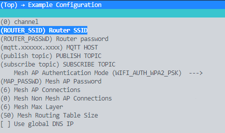
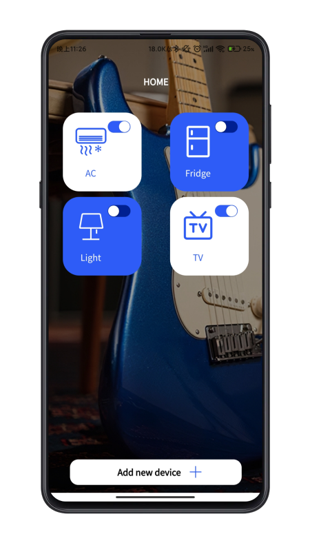

# ESP32-WIFI-MESH-SmartHome

Espressif ESP-IDF version:

- [release/v4.3](https://github.com/espressif/esp-idf/tree/release/v4.3)

## Configure the project

```cpp
idf.py menuconfig
```

```cpp
//Example Connection Configuration:
Set Router SSID
Set Router Password
Set MQTT HOST
Set PUBLISH_TOPIC
Set SUBSCRIBE_TOPIC
```




## Modify Control section

```cpp
// Modify the action performed after receiving the data at the MQTT callback "MQTT_EVENT_DATA"
// mqtt_app.c :43

case MQTT_EVENT_DATA:
    ESP_LOGI(TAG, "MQTT_EVENT_DATA");
    ESP_LOGI(TAG, "TOPIC=%.*s", event->topic_len, event->topic);
    ESP_LOGI(TAG, "DATA=%.*s", event->data_len, event->data);
```

## APP

>The supporting uniapp supports MQTT communication, touch the control panel to send the specified topic to realize device control. Support custom adding topic.

- [SmartHome-uniapp](https://github.com/Gitshaoxiang/SmartHome-uniapp)



## Reference

- [esp-idf ip_internal_network](https://github.com/espressif/esp-idf/tree/master/examples/mesh/ip_internal_network)

